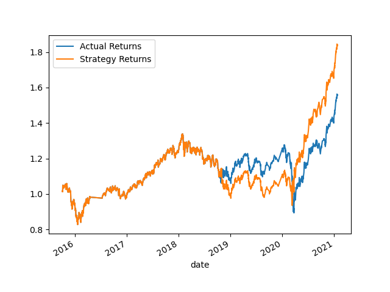
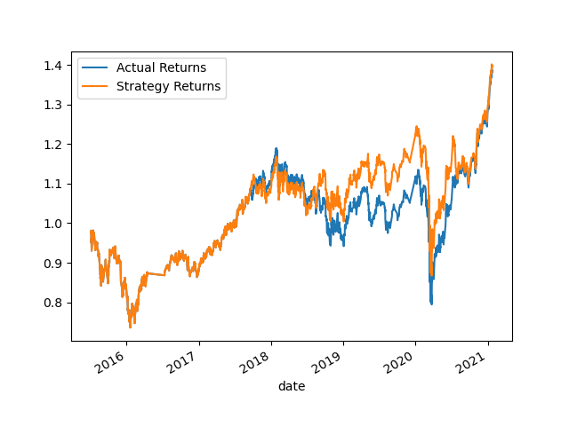
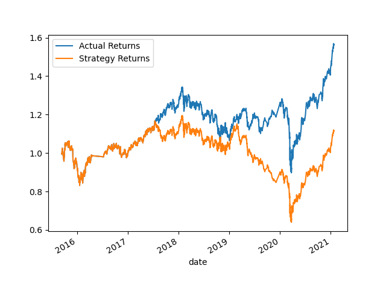
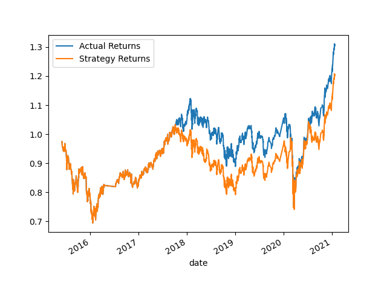
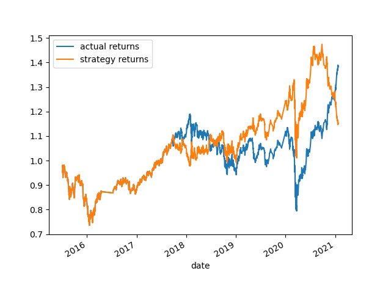

# module_14_challenge

## Strategy Analysis

### Part 1

- **Original Data Using SVC**

As it can be seen, by following the strategy provided from template, we are slight successful to outperform the "Actual Returns". In the template we have our short SMA = 4 , long SMA = 100 , and training data span for 3 months

## Part 2 Tune or Adjust the data

- **Increase or Decrease the Training Data**

By increasing DataOffset to 6 month both of our Actual Returns and Strategy Returns increase to rougly 1.6 and 1.8 respectively. The gap between the two variables also widened as we increase the size of training data set to 6 months

Contrastly, the returns and gap between two variables decrease when we reduce the size of training data set. We set dataoffset to be 1 month in this test.

- **Increase or Decrease the SMA input* features**

The actual cause of the horrendous outcome is when I tried to increase both short window and long window to 10 and 200 respectively. Our strategy returns extremely fell below actual returns.

I set the short window to 2 and long window to 50 and this is the result we get. While the difference between actual and strategy is much less than before, the returns remains dissapointing.

- **Best Improved Trading Algorithms Returns**

- After testing or tuning different size in variable, mainly in SMA size and training data size through dataoffset. I come to conclusion that changing SMA size does not improve the returns, meanwhile, greater size of training data tend to increase the return to a certain extent. 

## Part 3 Evaluate 

On the above, the actual returns vs strategy returns when new machine learning classifier is used which is Logistic Regression. The return during 2020 was a bit off, my assumption tells me that it is because the pandemic that cause market turmoil making it harder to predict.

##Conclusion
from the graph above, LogisticRegression provide slightly poorer prediction that baseline model and worse than tuned algorithm model. I assume SVC is a more suitable model that LogisticRegression in this case.

